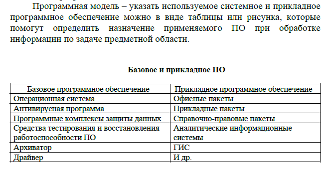

# Методологии структурного анализа и проектирования ИС

## Модели предметной области
1. **Информационная модель** отражает отношения между элементами системы в виде структур данных (состав и взаимосвязи). Например,  контекстная диаграмма IDEF0 или диаграмма потоков данных DFD

Пример контекстной диаграммы (IDEF0)

2. **Функциональная модель** описывает совокупность выполняемых системой функций, характеризует морфологию системы – состав функциональных подсистем, их взаимосвязи.

Пример – функциональная модель ИС. Для представления используются контекстная диаграмма IDEF0 и детализация  выполняемых функций посредством  диаграмм декомпозиции или диаграмма DFD.

Функциональная модель в нотации IDEF0

Пример диаграммы декомпозиции

Функциональная модель в нотации DFD

Схема «технологический процесс обработки информации»

Технологический процесс в нотации IDEF3

Технологический процесс в нотации BPMN

Технологический процесс в нотации ARIS EPC

## UML-диаграммы

Унифицированный язык моделирования , который в настоящее время фактически признан стандартным средством описания проектов, создаваемых с использованием объектно-ориентированного подхода.

## Диаграмма прецедентов (вариантов использования)

Разработку  спецификаций  программного  обеспечения  начинают  с  анализа требований  к функциональности,  указанных  в  техническом  задании.

В  процессе анализа  выявляют:

* внешних пользователей  разрабатываемого  программного обеспечения;
* перечень  отдельных  аспектов  его поведения  в  процессе взаимодействия  с  конкретными  пользователями.

Аспекты  поведения программного обеспечения были названы «вариантами использования» или «прецедентами» (use cases).

Вариант  использования  представляет  собой  характерную  процедуру  применения разрабатываемой системы конкретным действующим лицом, в качестве которого могут выступать не только люди, но и другие системы или устройства.

Каждый вариант использования связан с некоторой целью, имеющей самостоятельное значение.

Поведение разрабатываемой системы или по-другому функциональность разрабатываемой системы описывается с помощью функциональной модели, на которой отображены системные прецеденты и системное окружение, то есть действующие лица или актеры и связи между прецедентами и актерами. Такая диаграмма называется диаграмма прецедентов или диаграмма вариантов использования.

В  зависимости  от  цели  выполнения  конкретной процедуры  различают  следующие  варианты использования:

* основные  −  обеспечивают  требуемую  функциональность  разрабатываемого программного обеспечения;
* вспомогательные −  обеспечивают  выполнение  необходимых  настроек  системы и  ее обслуживание (например, архивирование информации и т. п.);
* дополнительные − обеспечивают дополнительные удобства для пользователя (как правило, реализуются  в  том  случае,  если  не  требуют  серьезных  затрат  каких-либо ресурсов  ни  при разработке, ни при эксплуатации).

Вариант  использования  можно  описать  кратко  или  подробно.

**Краткая  форма описания** содержит:
* название  варианта  использования,
* его  цель,  действующих  лиц,
* тип  варианта использования (основная, второстепенная или дополнительная) и его краткое описание.

## Краткое описание  варианта  использования

Выполнение  задания системы  решения  комбинаторно-оптимизационных задач можно представить в следующем виде: 

| Название варианта  | Выполнение задания|
|--------------------|--------------------------------------------------------------------------------------------------------------|
| Цель |Получение результатов решения задачи|
| Действующие лица |Пользователь |
| Краткое описание   | Решение задачи предполагает выбор задачи, выбор алгоритма, задание данных и получение результатов решения.|
| Тип варианта |Основной |

Основные  варианты  использования  обычно  описывают  подробно,  стараясь отразить особенности  предметной  области  разрабатываемого  программного обеспечения.  Подробная форма,  кроме  указанной  выше  информации,  включает описание  типичного  хода  событий  и возможных  альтернатив.

Типичный  ход  событий представляют  в  виде  диалога  между пользователями  и  системой,  последовательно нумеруя  события.  Если  пользователь  может  выбирать варианты, то их описывают в отдельных таблицах. Также отдельно приводят альтернативы, связанные  с  нарушением типичного  хода  событий.

Вариант использования **Выполнение задания**

Типичный ход событий

Альтернатива

11.Если время выполнения программы с точки зрения пользователя велико, то он прерывает процесс выполнения.

12.Система прерывает расчеты, предлагает список алгоритмов решения и возвращается на шаг 7.

Дополнительная информация

1. Необходимо  обеспечить  произвольную  последовательность  выбора  типа  задачи,  данных  и алгоритма.
2. Необходимо обеспечить возможность выхода из варианта на любом этапе.

Раздел **Ввод данных**

Типичный ход событий

Альтернатива

4.Если  обнаружены  некорректные  данные,  то  система  выдает  сообщение  об  ошибке  и предлагает их исправить, возвращаясь на предыдущий шаг.
