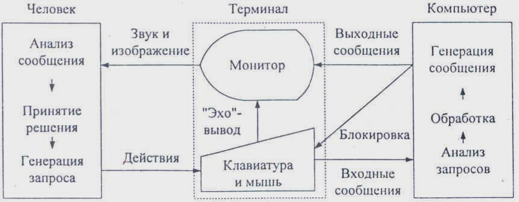
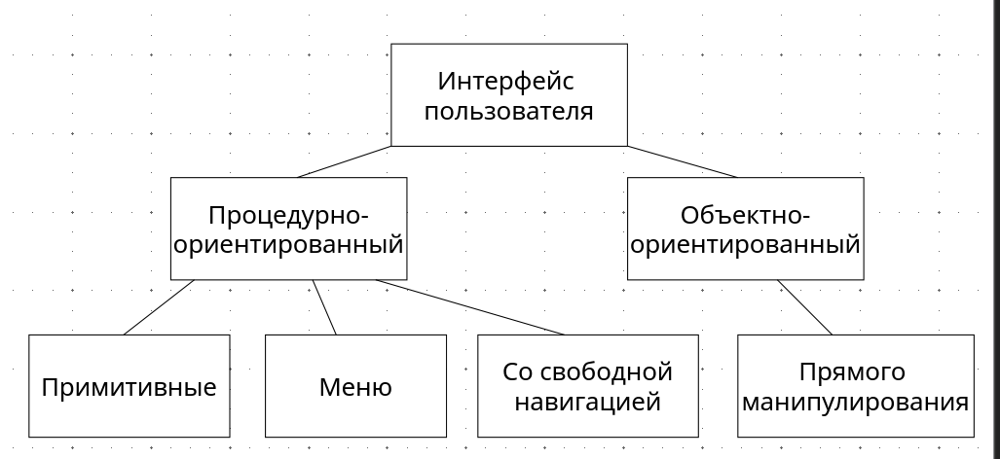
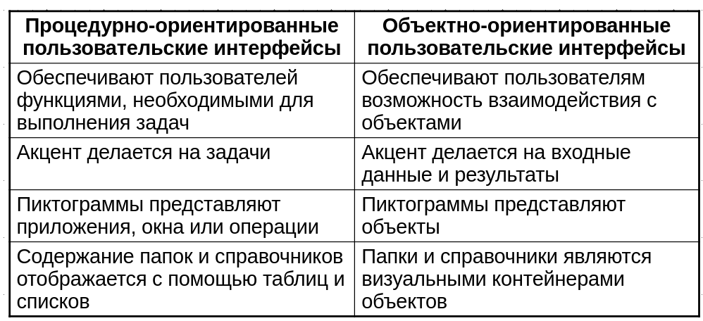

# Разработка пользовательских интерфей

Пользовательский интерфейс представляет собой совокупность программных и аппаратных средств, обеспечивающих взаимодействие пользователя с компьютером. 

Основу такого взаимодействия составляют диалоги. Под диалогом в данном случае понимают регламентированный обмен информацией между человеком и компьютером, осуществляемый в реальном масштабе времени и направленный на совместное решение конкретной задачи. 

Каждый диалог состоит из отдельных процессов ввода-вывода, которые физически обеспечивают связь пользователя и компьютера.

# Обмен информацией

* Обмен информацией осуществляется передачей сообщений и управляющих сигналов. 
* ***Сообщение*** - порция информации, участвующая в диалоговом обмене. 

Различают:

* входные сообщения, которые генерируются человеком с помощью средств ввода: клавиатуры, манипуляторов, например мыши и т. п.;
* выходные сообщения, которые генерируются компьютером в виде текстов, звуковых сигналов и/или изображений и выводятся пользователю на экран монитора или другие устройства вывода информации.

# Организация взаимодействия между компьютером и человеком

# Типы интерфейсов

# Примитивный интерфейс
* **Примитивным** называют интерфейс, который организует взаимодействие с пользователем в консольном режиме. 
* Обычно такой интерфейс реализует конкретный сценарий работы программного обеспечения, например: ввод данных - решение задачи - вывод результата. 
* Подобные интерфейсы в настоящее время используют только в процессе обучения программированию или в тех случаях, когда вся программа реализует одну функцию, например, в некоторых системных утилитах.
# Интерфейс-меню
* **Интерфейс-меню** позволяет пользователю выбирать необходимые операции из специального списка, выводимого ему программой. Эти интерфейсы предполагают реализацию множества сценариев работы.

* Различают **одноуровневые** и **иерархические меню**. Первые используют для сравнительно простого управления вычислительным процессом. Вторые – при большом количестве вариантов или их очевидных различиях, например, операции с файлами и операции с данными, хранящимися в этих файлах.

* Интерфейсы данного типа несложно реализовать в рамках структурного подхода к программированию.
# Интерфейсы со свободной навигацией 
* **Интерфейсы со свободной навигацией** также называют *графическими пользовательскими интерфейсами* (GUI - Graphic User Interface) или интерфейсами WYSIWYG (What You See Is What You Get). 

* Графические интерфейсы поддерживают концепцию интерактивного взаимодействия с программным обеспечением, осуществляя визуальную обратную связь с пользователем и возможность прямого манипулирования объектами и информацией на экране. 

* Интерфейсы данного типа поддерживают концепцию совместимости программ, позволяя перемещать между ними информацию.

# Интерфейс прямого манипулирования
Этот тип интерфейса предполагает, что взаимодействие пользователя с программным обеспечением осуществляется посредством выбора и перемещения **пиктограмм**, соответствующих объектам предметной области. 

Для реализации таких интерфейсов также используют событийное программирование и объектно-ориентированные библиотеки.
# Пример программы построения графиков
# Пользовательская модели интерфейса
* Модель программиста
* Модель пользователя
* Программная модель

Пользовательская модель интерфейса - это совокупность обобщенных представлений конкретного пользователя или некоторой группы пользователей о процессах, происходящих во время работы программы или программной системы.

Модель базируется на опыте пользователей, который характеризуется:

* уровнем подготовки в предметной области разрабатываемого программного обеспечения;
* интуитивными моделями выполнения операций в этой предметной области;
* уровнем подготовки в области владения компьютером;
* устоявшимися стереотипами работы с компьютером.

# Критерии оценки интерфейса пользователем
Многочисленные опросы и обследования, проводимые ведущими фирмами по разработке программного обеспечения, показали, что **основными критериями оценки** интерфейсов пользователем являются:
* простота освоения и запоминания операций системы - конкретно оценивают время освоения и продолжительность сохранения информации в памяти;
* скорость достижения результатов при использовании системы - определяется количеством вводимых или выбираемых мышью команд и настроек;
* субъективная удовлетворенность при эксплуатации системы (удобство работы, утомляемость и т. д.).

# Классификации диалогов
Диалог -- это процесс обмена информацией между пользователем и программной системой, осуществляемый через интерактивный терминал и по определенным правилам.

Различают **тип диалога** и его **форму**.

**Тип диалога** определяет, кто из «собеседников» управляет процессом обмена информацией. 

Различают два типа диалога: 
* управляемые программой;
* управляемые пользователем.

# Типы диалога
Диалог, *управляемый программой*, предусматривает наличие жесткого, линейного или древовидного, т. е. включающего возможные альтернативные варианты, сценария диалога, заложенного в программное обеспечение. Такой диалог обычно сопровождают большим количеством подсказок, которые уточняют, какую информацию необходимо вводить на каждом шаге.

Диалог, управляемый пользователем, подразумевает, что сценарий диалога зависит от пользователя, который применяет систему для выполнения необходимых ему операций. При этом система обеспечивает возможность реализации различных пользовательских сценариев.

# Формы диалога
Описание языка, на котором ведется диалог, включает определение его **синтаксиса** и **семантики**. 

В зависимости от вида используемых в конкретном случае синтаксиса и семантики различают три формы диалога:

* Фразовую;
* Директивную;
* Табличную.

## Фразовая форма
*Фразовая форма* предполагает «общение» с пользователем на естественном языке или его подмножестве. Содержание диалога в данной форме составляют вопросы и ответы.

Общение может осуществляться в свободном формате, но возможна и фиксация отдельных фраз.

Организация диалога на естественном языке на современном уровне - задача не решенная.

Пример:
* Программа: Введите свой возраст (полных лет):
* Пользователь: 48.

Программа содержит описание  синтаксиса и семантики используемого **ограниченно-естественного языка**. 

Для данного примера достаточно определить синтаксис понятия «целое положительное число» и наложить ограничение на значение числа.
## Фразовая форма (достоинства и недостатки)
Основное **достоинство** фразовой формы состоит в относительно **свободном общении** с системой.

Основными недостатками фразовой формы при использовании являются:
* большие затраты ресурсов;
* отсутствие гарантии однозначной интерпретации формулировок;
* необходимость ввода длинных грамматически правильных фраз.

## Директивная форма
**Директивная форма**  предполагает использование команд **специально разработанного формального языка.**

Командой в этом случае называют предложение этого языка.

Команду можно вводить:
* в виде строки текста, специально разработанного формата;
* нажатием некоторой комбинации клавиш клавиатуры;
* посредством манипулирования мышью;
* комбинацией второго и третьего способов.
## Директивная форма (достоинства и недостатки)
**Основными достоинствами** директивной формы являются:

* сравнительно небольшой объем вводимой информации;
* гибкость - возможности выбора операции в данном случае ограничены только набором допустимых команд;
* ориентация на диалог, управляемый пользователем;
* использование минимальной области экрана или неиспользование ее вообще;
* возможность совмещения с другими формами.

**Недостатки** директивной формы:
* практическое отсутствие подсказок на экране, что требует запоминания вводимых команд и их синтаксиса;
* почти полное отсутствие обратной связи о состоянии инициированных процессов;
* необходимость навыков ввода текстовой информации или манипуляций мышью;
* отсутствие возможности настройки пользователем.
## Табличная форма
Табличная форма предполагает, что пользователь выбирает ответ из предложенных программой. 

Язык диалога для табличной формы имеет простейший синтаксис и однозначную семантику, что достаточно легко реализовать. 

Удобно пользователю, так как выбрать всегда проще. 

Однако применение табличной формы возможно не всегда: ее можно использовать только, если множество возможных ответов на конкретный вопрос конечно. 

Причем, если количество возможных ответов велико (более 20), то применение табличной формы может оказаться нецелесообразным.
## Табличная форма (достоинства и недостатки)
**Достоинствами** табличной формы являются:
* наличие подсказки, что уменьшает нагрузку на память пользователя, так как данная форма ориентирована не на запоминание, а на узнавание;
* сокращение количества ошибок ввода: пользователь не вводит информацию, а указывает на нее;
* сокращение времени обучения пользователя;
* возможность совмещения с другими формами;
* в некоторых случаях возможность настройки пользователем.

**Недостатками** табличной формы являются:
* необходимость наличия навыков навигации по экрану;
* использование сравнительно большой площади экрана для изображения визуальных компонентов;
* интенсивное использование ресурсов компьютера, связанное с необходимостью постоянного обновления информации на экране.
