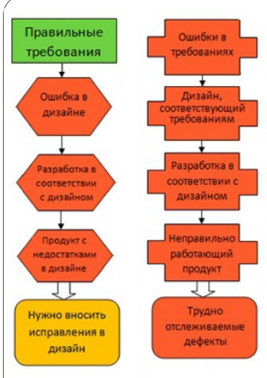

# Основные понятия и определения

**Тестирование программного обеспечения** 
– это одна из техник контроля качества, включающая в себя активности по планированию работ, проектированию тестов, выполнению тестирования и анализу полученных результатов.*

**Верификация**
– это процесс оценки
системы или её компонентов с целью
определения, удовлетворяют ли
результаты текущего этапа
разработки условиям,
сформированным в начале этого
этапа. Т.е. выполняются ли наши
цели, сроки, задачи по разработке
проекта, которые были определены в
начале текущей фазы.Валидация – это определение
соответствия разрабатываемого ПО
ожиданиям и потребностям
пользователя, требованиям к системе.

## Верификация и валидация

|№ | Верификация | Валидация |
|:-:|:-|:-|
|1 | Делаем ли мы продукт правильно? | Делаем ли мы правильный продукт?
|2 | Реализована ли вся функциональность? | Правильно ли реализована функциональность?
|3 | Происходит раньше, включает проверку правильности написания документации, кода и т.д. | Происходит после верификации, отвечает за оценку продукта в целом.
|4 | Производится разработчиками | Производится тестировщиками
|5 | Включает статический анализ – инспектирование кода, сравнение требований и т.п. | Включает динамический анализ – выполнение программы для сравнения ее реальной работы с установленными требованиями
|6 | Основывается на объективной оценке соответствия реализованных функций | Субъективный процесс, включающий личную оценку качества работы ПО

С помощью валидации можно быть уверенным в
том, что создан «правильный» продукт. Продукт,
который полностью удовлетворяет заказчика.

С помощью верификации можно увериться в том,
что продукт сделан «правильно»: придерживаясь
необходимых методик, инструментов и стандартов.
На практике отличия верификации и валидации
имеют большое значение:
* заказчика интересует, в большей степени,
валидация удовлетворение собственных
требований);
* исполнителя, в свою очередь, волнует не только
соблюдение всех норм качества (верификация) при
реализации продукта, а и соответствие всех
особенностей продукта желаниям заказчика.

**План Тестирования** 
– это документ,
который описывает весь объем работ
по тестированию, начиная с
описания объекта, стратегии,
расписания, критериев начала и
окончания тестирования до
необходимого в процессе работы
оборудования, специальных знаний,
а также оценки рисков с вариантами
их разрешения.

**Тест дизайн** 
– это этап процесса
тестирования ПО, на котором
проектируются и создаются тестовые
случаи (тест-кейсы), в соответствии с
определенными ранее критериями
качества и целями тестирования.

**Тестовый случай** 
– это артефакт,
описывающий совокупность шагов,
конкретных условий и параметров,
необходимых для проверки реализации
тестируемой функции или её части.

**Баг/Дефект Репорт** 
– это документ,
описывающий ситуацию или
последовательность действий, приведшую к
некорректной работе объекта тестирования
с указанием причин и ожидаемого
результата.

**Тестовое Покрытие** 
– это одна из метрик
оценки качества тестирования,
представляющая из себя плотность
покрытия тестами требований либо
исполняемого кода.

**Детализация Тест-Кейсов** 
– это
уровень детализации описания тестовых
шагов и требуемого результата, при
котором обеспечивается разумное
соотношение времени прохождения к
тестовому покрытию.

**Время Прохождения Тест Кейса** 
– это
время от начала прохождения шагов
тест-кейса до получения результата
теста.

**Характеристики качества ПО**

* Функциональность (Functionality)
* Надежность (Reliability)
* Удобство использования (Usability)
* Эффективность (Efficiency)
* Удобство сопровождения
(Maintainability)
* Портативность (Portability)

**Функциональность** – определяется
способностью ПО решать задачи,
которые соответствуют
зафиксированным и предполагаемым
потребностям пользователя, при
заданных условиях использования ПО.
Т.е. эта характеристика отвечает за то,
что ПО работает исправно и точно,
функционально совместимо
соответствует стандартам отрасли и
защищено от несанкционированного
доступа.

**Надежность** – способность ПО
выполнять требуемые задачи в
обозначенных условиях на
протяжении заданного промежутка
времени или указанное количество
корректно восстанавливаться после
сбоев в работе, отказоустойчивость.

**Удобство использования** 
–
возможность легкого понимания,
изучения, использования и
привлекательности ПО для
пользователя.

**Эффективность** – способность ПО
обеспечивать требуемый уровень
производительности, в соответствии с
выделенными ресурсами, временем и
другими обозначенными условиями.

Удобство сопровождения –
легкость, с которой ПО может
анализироваться, тестироваться,
изменяться для исправления
дефектов для реализации новых
требований, для облегчения
дальнейшего обслуживания и
адаптирования к имеющемуся
окружению.

Портативность – характеризует
ПО с точки зрения легкости его
переноса из одного окружения
(software/ hardware) в другое.

## Модель качества
программного обеспечения
На данный момент наиболее
распространена и используется
многоуровневая модель качества
программного обеспечения,
представленная в наборе
стандартов ISO 9126.
На верхнем уровне выделено 6
основных характеристик качества
ПО.

## Откуда берутся ошибки в ПО?

Ошибка – это действие человека,
которое порождает неправильный
результат.

Недостатки в самом
программном обеспечении
называются дефектами или багами
(оба обозначения равносильны).
Программное обеспечение – нечто
большее, чем просто код.

Дефект, Баг – недостаток
компонента или системы, который
может привести к отказу
определенной функциональности.
Дефект, обнаруженный во время
исполнения программы, может
вызвать отказ отдельного
компонента или всей системы.

При исполнении кода программы
дефекты, заложенные еще во время его
написания, могут проявиться:
программа может не делать того, что
должна или наоборот делать то, чего не
должна – происходит сбой.

Сбой – несоответствие фактического
результата работы компонента или
системы ожидаемому результату.

Сбой в работе программы может
являться индикатором наличия в ней
дефекта.

Таким образом, баг (дефект)
существует при одновременном
выполнении трех условий:
* известен ожидаемый результат;
* известен фактический результат;
* фактический результат отличается от ожидаемого результата.

Не все баги становятся причиной
сбоев – некоторые из них могут никак
себя не проявлять и оставаться
незамеченными (или проявляться
только при очень специфических
обстоятельствах).

Источники дефектов и сбоев:
* ошибки в спецификации, дизайне или
реализации программной системы;
* ошибки использования системы;
* неблагоприятные условия окружающей
среды;
* умышленное причинение вреда;
* потенциальные последствия предыдущих ошибок, условий или умышленных действий.

Дефекты могут возникать на разных
уровнях, и от того, будут ли они исправлены
и когда, будет напрямую зависеть качество
системы.

Качество – степень, в которой
совокупность присущих характеристик
соответствует требованиям.

Качество программного обеспечения –
это совокупность характеристик
программного обеспечения, отражающих
его способность удовлетворять
установленные и предполагаемые
потребности.

Требование – потребность или
ожидание, которое установлено. Обычно
предполагается или является
обязательным.

В первом случае все было
сделано правильно и мы
получили продукт, полностью
соответствующий ожиданиям
заказчика и удовлетворяющий
критериям качества.

Во втором случае ошибки
были допущены уже при
кодировании, что привело к
появлению дефектов в
готовом продукте. Но на этом
уровне баги достаточно легко
обнаружить и исправить,
поскольку мы видим
несоответствие требованиям.

Третий вариант – ошибки
были допущены на этапе
проектирования системы.
Заметить это можно лишь
проведя тщательную сверку
со спецификацией. Исправить
такие дефекты тоже непросто
– нужно заново
перерабатывать дизайн
продукта.

В четвертом случае
дефекты были заложены еще
на этапе формирования
требований; вся дальнейшая
разработка и даже
тестирование пошли по
изначально неправильному
пути. Во время тестирования
мы не найдем багов 

## Причины появления дефектов в программном коде

* Недостаток или отсутствие общения в команде.
Требования должны быть доступны и понятны
всем участникам процесса разработки ПО.
* Сложность программного обеспечения.
Чем труднее работа, тем больше ошибок может
допустить исполняющий ее человек.
* Изменения требований. Даже незначительные изменения требований на поздних этапах разработки требуют большого объема работ по внесению изменений в систему.
* Плохо документированный код.
* Средства разработки ПО.

## Принципы тестирования
* Тестирование показывает наличие дефектов

Тестирование может показать наличие дефектов
в программе, но не доказать их отсутствие. Тем
не менее, важно составлять тест-кейсы,
которые будут находить как можно больше
багов. Таким образом, при должном тестовом
покрытии, тестирование позволяет снизить
вероятность наличия дефектов в программном
обеспечении. В то же время, даже если дефекты
не были найдены в процессе тестирования,
нельзя утверждать, что их нет.

* Исчерпывающее тестирование невозможно

Невозможно провести исчерпывающее
тестирование, которое бы покрывало все
комбинации пользовательского ввода и
состояний системы, за исключениям совсем
уж примитивных случаев. Вместо этого
необходимо использовать анализ рисков и
расстановку приоритетов, что позволит более
эффективно распределять усилия по
обеспечению качества ПО.

Принципы тестирования

* Раннее тестирование
Тестирование должно начинаться как можно
раньше в жизненном цикле разработки
программного обеспечения и его усилия
должны быть сконцентрированы на
определенных целях.

Принципы тестирования
* Скопление дефектов
Разные модули системы могут содержать разное
количество дефектов, то есть плотность
скопления дефектов в разных элементах
программы может отличаться. Усилия по
тестированию должны распределяться
пропорционально фактической плотности
дефектов. В основном, большую часть
критических дефектов находят в
ограниченном количестве модулей. Это
проявление принципа Парето: 80% проблем
содержатся в 20% модулей.

Принципы тестирования
* Парадокс пестицида
Прогоняя одни и те же тесты вновь и вновь, Вы
столкнетесь с тем, что они находят все меньше
новых ошибок. Поскольку система
эволюционирует, многие из ранее найденных
дефектов исправляют и старые тест-кейсы больше
не срабатывают.
Чтобы преодолеть этот парадокс, необходимо
периодически вносить изменения в используемые
наборы тестов, рецензировать и корректировать
их с тем, чтобы они отвечали новому состоянию
системы и позволяли находить как можно большее
количество дефектов.

* Тестирование зависит от контекста
Выбор методологии, техники и типа тестирования
будет напрямую зависеть от природы самой
программы. Например, программное
обеспечение для медицинских нужд требует
гораздо более строгой и тщательной проверки,
чем, скажем, компьютерная игра. Из тех же
соображений сайт с большой посещаемостью
должен пройти через серьезное тестирование
производительности, чтобы показать
возможность работы в условиях высокой
нагрузки.

* Заблуждение об отсутствии ошибок
Тот факт, что тестирование не обнаружило
дефектов, еще не значит, что программа
готова к релизу. Нахождение и исправление
дефектов будет не важным, если система
окажется неудобной в использовании и не
будет удовлетворять ожиданиям и
потребностям пользователя.

* тестирование должно производиться
независимыми специалистами;
* привлекайте лучших профессионалов;
* тестируйте как позитивные, так и негативные
сценарии;
* не допускайте изменений в программе в
процессе тестирования;
* указывайте ожидаемый результат
выполнения тестов.
